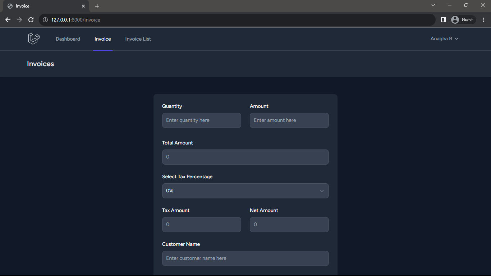
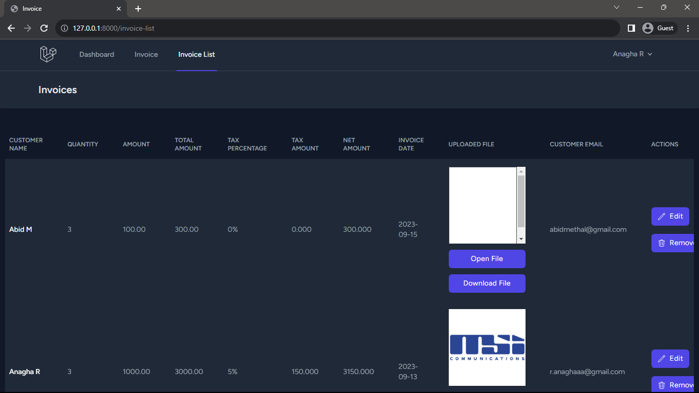

 <h1 align="center">Invoicing Website</h1>

<h3>Project Description</h3>

Implemented a Laravel-based invoicing website enabling users to create invoices in a person's name, featuring robust CRUD operations and Laravel's mailing system. This platform streamlines the invoicing process, allowing for easy creation, updating, and deletion of invoices.

Users can effortlessly generate personalized invoices for individuals, leveraging the CRUD functionalities for efficient management. The integration of Laravel's mailing system ensures prompt communication by sending invoices directly to recipients, enhancing transparency and professionalism in the billing process.

